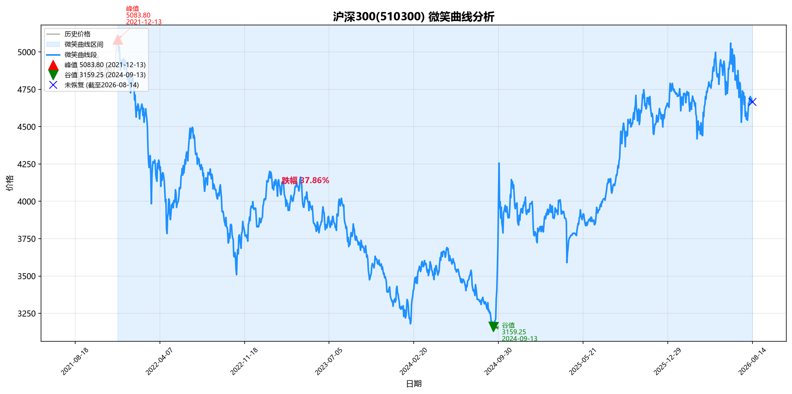
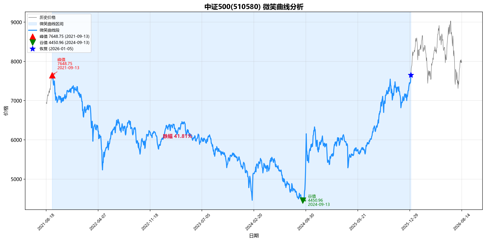

# Day 12 报告

> **学生**：justin ｜ **出资人**：___ ｜ **日期**：2026-08-17 ｜ 协作助手：QoderWork

---

## 一、510580 第3期定投执行记录

| 步骤 | 结果 |
|------|------|
| 今日价格 | ¥4.262 |
| 计算方案 | 买 1 手 = 100 份，花费 ¥426.2，滚存 ¥0 |
| APP 执行 | ✅ 完成（成交价 ¥4.262，100 份） |
| add_purchase | ✅ |
| mark_done | ✅ 第3期已完成 |

---

## 二、510300 持仓状态

| 字段 | 值 |
|------|-----|
| 持仓份额 | 11,500 份 |
| 持仓均价 | ¥4.849 |
| 已投入总额 | ¥55,763.5（一次性投入，非定投） |
| 今日价格 | ¥4.801 |
| 当前市值 | ¥55,211.5 |
| 浮盈亏 | ¥-552.0（-0.99%） |

---

## 三、510300 微笑曲线分析

### 3.1 分析结果

```
peak_date   = 2021-12-13    peak_value  = 5083.80
trough_date = 2024-09-13    trough_value = 3159.25
recovery    = 尚未恢复（截至 2026-08-17，当前 4741.10）
max_drawdown = -37.86%

DCA模拟（每14天 ¥500，峰值→最新）:
  total_cost  = 40,500 元    num_periods = 81 期
  avg_cost    = 4,003.38     final_price = 4,741.10
  dca_saving  = -2,730.11 元（尚未恢复，定投成本高于一次性）
```

| # | 问题 | 答案 |
|---|------|------|
| 1 | 历史最大跌幅 | -37.86% |
| 2 | 填满微笑曲线坑需要多少元 | ¥40,500（81期 x ¥500） |
| 3 | 每期 ¥500，¥10,000 预算还需多少期补完差额 | 61 期（已投20期=¥10,000，剩余 ¥30,500） |
| 4 | 覆盖完整曲线，投资人共需追加 | ¥30,500 |

图表：





### 3.2 工具自测（510580）

```
peak_date   = 2021-09-13    peak_value  = 7648.75
trough_date = 2024-09-13    trough_value = 4450.96
recovery    = 2026-01-05    recovery_value = 7651.20
max_drawdown = -41.81%

DCA模拟（每14天 ¥500，峰值→恢复日）:
  total_cost  = 37,500 元    num_periods = 75 期
  avg_cost    = 5,968.77     final_price = 7,651.20
  dca_saving  = 12.01 元（定投略优于一次性）
```

| # | 问题 | 答案 |
|---|------|------|
| 1 | 历史最大跌幅 | -41.81% |
| 2 | 填满微笑曲线坑需要多少元 | ¥37,500（75期 x ¥500） |
| 3 | 每期 ¥500，¥10,000 预算还需多少期补完差额 | 55 期（已投20期=¥10,000，剩余 ¥27,500） |
| 4 | 覆盖完整曲线，投资人共需追加 | ¥27,500 |

工具通用性：✅（510300 / 510580 均可正常运行）

---

## 四、510300 定投计划

每期 ¥500，与510580定投同步，在510580定投那周的周五执行。

| 期数 | 计划日期（周五，510580同周） | 标的 | 每期金额 |
|------|----------------------------|------|--------|
| 1 | 8月29日 | 沪深300ETF华泰柏瑞(510300) | ¥500 |
| 2 | 9月12日 | 同上 | ¥500 |
| 3 | 9月26日 | 同上 | ¥500 |
| 4 | 10月10日 | 同上 | ¥500 |
| 5 | 10月24日 | 同上 | ¥500 |
| 6 | 11月7日 | 同上 | ¥500 |

投资人确认：✅ 同意 / ❌ 需调整（___）

---

## 五、提交前检查

- [x] 510580第3期执行完毕，截图在 assets/
- [x] add_purchase + mark_done 已运行
- [x] 微笑曲线分析工具已增强
- [x] 510300微笑曲线分析完成，图表已生成
- [ ] 510300定投计划已制定，投资人已确认
- [x] 报告填写完整
- [x] PR 已发起
