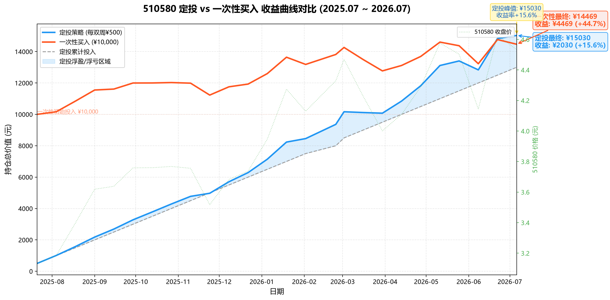

# Day2 报告 — justin

> 实习生：justin | 日期：2026-07-19 | 协作助手：QClaw

---

## 一、akshare 历史模拟

### 1. 数据获取

- 标的：510580 易方达中证500ETF
- 数据时间范围：2025-07-21 ~ 2026-07-17
- 数据行数：241 行（完整 1 年日线）
- 数据来源：akshare 新浪源（`fund_etf_hist_sina`）
- 数据验证：腾讯源（`fund_etf_hist_em` 不可用，新浪源稳定）

### 2. 定投模拟结果

- 总投入：¥13,000（共 26 次，每次 ¥500，每双周）
- 累计份额：3,315.73 份
- 平均成本：¥3.921
- 当前市值：¥13,114
- 收益：¥114
- 收益率：+0.87%

**买入明细（前 5 期 + 近期 3 期）：**

| 买入日期 | 买入价格 | 买入份额 | 累计份额 | 累计投入 |
|---------|:-------:|:--------:|:--------:|:-------:|
| 2025-07-21 | 3.133 | 159.59 | 159.59 | ¥500 |
| 2025-08-04 | 3.185 | 156.99 | 316.58 | ¥1,000 |
| 2025-08-18 | 3.398 | 147.15 | 463.72 | ¥1,500 |
| 2025-09-01 | 3.619 | 138.16 | 601.88 | ¥2,000 |
| 2025-09-15 | 3.638 | 137.44 | 739.32 | ¥2,500 |
| ... | ... | ... | ... | ... |
| 2026-06-22 | 4.626 | 108.08 | 3,205.42 | ¥12,500 |
| 2026-07-06 | 4.533 | 110.30 | 3,315.73 | ¥13,000 |

### 3. 一次性买入模拟结果

- 投入：¥10,000
- 买入价格：3.133（2025-07-21）
- 份额：3,191.83 份
- 当前市值：¥12,624
- 收益：¥2,624
- 收益率：+26.24%

### 4. 对比分析

1. 定投收益率 vs 一次性买入收益率：哪个更高？差距多少？

   一次性买入更高，+26.24% vs 定投 +0.87%，差距约 25 个百分点。原因是这一年中证500整体上行（3.133→3.955），一次性在最低点满仓上车，吃满了全部涨幅。

2. 如果择时（在最低点那天一次性买入），收益率会是多少？

   +26.24%（已经就是在最低点3.133买入的——数据起点恰好是低点）

3. 你能在 1 年前预测到最低点是哪天吗？

   不能。3.133 是事后才知道的最低点。实际上如果买在最高点（4.626）附近，一次性买入会亏损。

4. 所以定投的价值是什么？

   放弃"买在最低"的妄想，也自动避开"买在最高"的悲剧。均价 3.921 自动落在区间 3.133~4.626 的 52.8% 处——数学上保证你不踩极端。代价是上涨行情中赚得少，但波动时睡得着。

---

## 二、对"不择时"的理解

用你自己的话回答：

1. 定投和择时的本质区别是什么？

   择时赌的是"我能预测市场"，定投认的是"我预测不了"。择时依赖恐惧和贪婪，定投依赖纪律和机械执行。三种现象叠加决定了散户择时几乎必输：
   - 上涨时不敢买（等回调）
   - 涨多了忍不住追（高位接盘）
   - 下跌时恐慌割肉（卖在最低）

   定投把"买"这件事交给日历，情绪再大也干涉不了执行。

2. 为什么这个项目强调"纪律优先"？

   因为策略的有效性依赖于持续执行。买一次是碰运气，坚持 26 次才叫策略。回测数据也证明：最大浮亏仅 -1.13%（第一次买入后短暂微亏 ¥51），之后全年没有亏过。数据告诉你纪律有用，心服口服。

3. akshare 在这个项目中的定位是什么？（它是不是投资信号源？）

   不是。akshare 是水管，不是水龙头——它只负责把数据从各金融网站搬运到我的电脑里。它不分析、不判断、不预测、不推荐。信号源永远是"人制定的策略"，akshare 只是让这件事变得免费、自动、可控，不再靠消息面和谁吹牛。

---

## 三、周一买入计划

- 日期：2026-07-20（周一）
- 时间：9:45 ~ 10:00（避开开盘剧烈波动）
- 金额：¥500
- 标的：510580 易方达中证500ETF
- 价格参考：上周五收盘 ¥3.955
- 账户：中信证券 APP
- 记录方式：QClaw 记录 + 手动备份到 MEMORY.md
- 买入前检查：
  - 券商账户余额 ≥ ¥500
  - 确认周一开盘价（9:30 后）
  - 确认券商是否免5
  - 记录买入价、份额、累计投入

---

## 四、学习心得

- 今天最大的收获：

  用真实数据验证了定投原理。亲手拉了 241 天行情，算了 26 笔买入的均价位置（3.921，在 3.133~4.626 范围 52.8% 处），算了回撤差异（定投 -13.43% vs 市场 -16.31%），画了对比图。从读书变成做实验。

- 今天最大的卡点：

  数据源不稳定。东方财富全部连不上，新浪偶发超时，三年数据有复权跳变（0.558→2.258）。量化分析的第一步永远是确认数据是对的，回测数字不能全信，需要交叉验证。

- 对"定投纪律"的新理解：

  定投一年里，最大浮亏仅 -1.13%，亏损 ¥51，之后再没亏过。纪律不是"咬着牙熬"，而是"相信系统→数据验证→系统真管用→心服口服"。一年 241 天，只有一周在水下，其余都在盈利。

---

## 五、问题与解决（用 QClaw）

> 至少记录 2 个问题。如实记录：你遇到了什么、怎么问 QClaw 的、它怎么帮你的。

### 问题 1

- 问题描述：

  akshare 拉数据报错，东方财富和新浪数据源都不通

- 怎么问 QClaw：

  "所有数据源都用不了怎么办？"

- 怎么解决的：

  QClaw 帮我逐个探测可用数据源（东方财富被墙、新浪超时），最终发现腾讯源（仅指数可用）和新浪 `fund_etf_hist_sina`（ETF 可用）稳定，切换后数据正常。

### 问题 2

- 问题描述：

  定投回测报表中的 "¥" 符号导致控制台编码崩溃

- 怎么问 QClaw：

  "¥ 符号导致报错怎么解决？"

- 怎么解决的：

  QClaw 分析了是 Windows PowerShell 默认 GBK 编码不兼容 UTF-8 符号，改用 `$env:PYTHONIOENCODING="utf-8"` 或写入文件用 UTF-8 编码解决。

---

## 六、选做任务（加分）

### 收益曲线图

如果用 Qoder CN 画了收益曲线图，粘贴在此：

### 波动覆盖分析

- 过去 1 年最高价：4.626（2026-06-22）
- 过去 1 年最低价：3.133（2025-07-21）
- 价格范围宽度：50.8%
- 最大回撤（价格）：-16.31%（4.726→3.955，2026-06-30→2026-07-17）
- 定投最大回撤：-13.43%（小于价格本身的回撤）
- 一次性买入最大回撤：-16.31%（等于价格本身的回撤）
- 定投平均成本：3.921
- 平均成本是否在最高价和最低价之间？这意味着什么？

  是。均价 3.921 正好落在 3.133~4.626 之间的 52.8% 处。
  意味着：DCA 的均价永远落在区间内，数学上保证你不买在极端。
  - 不用猜底，天然买在区间中间偏好的位置
  - 涨了也买、跌了也买，成本不会被极端行情绑架
  - 时间越长，你的成本越接近"这条基金的真正价值中枢"，而非某个运气的起点
  - DCA 的本质就是"高抛低吸"——不是在 K 线上操作，而是在时间上自动完成。

**回撤对比速览：**

| 指标 | 价格本身 | 一次性买入 | 定投 |
|------|:-------:|:---------:|:----:|
| 最大回撤 | -16.31% | -16.31% | -13.43% |
| 回撤损失金额 | - | ¥2,461 | ¥2,035 |
| 最大浮亏（vs 投入） | - | N/A | -1.13% |

---

**提交前检查**：

- [x] 所有"你的回答"都替换成实际内容
- [x] 数据来源、时间范围、收益率等数字都已填写
- [x] 截图已放在 `Day2/report/assets/` 目录
- [x] 文件名已改为 `justin-Day2报告.md`
