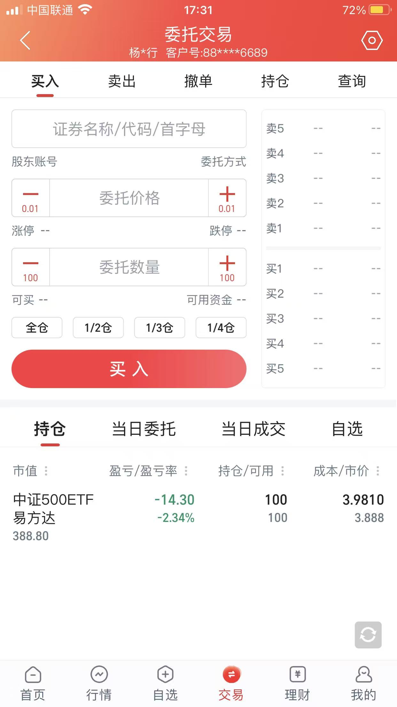
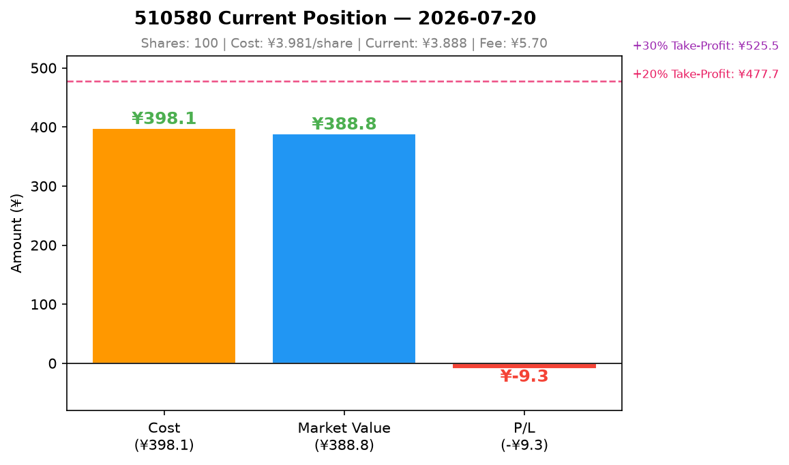
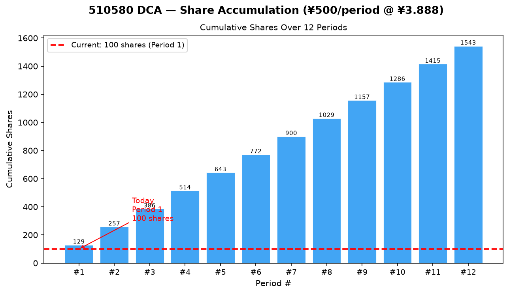
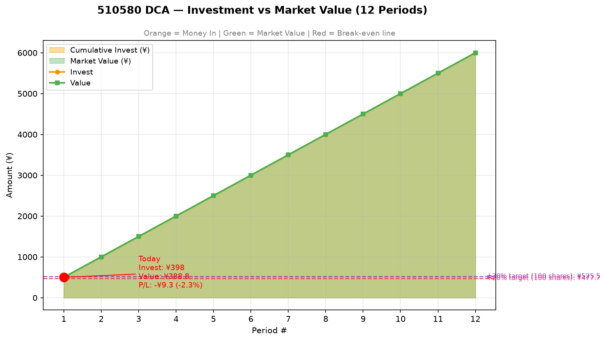

# Day 3 报告 — justin

> 实习生：justin | 日期：2026-07-20 | 协作助手：QClaw

---

## 一、第一次买入记录

- 标的代码：510580
- 标的名称：易方达中证500ETF
- 买入金额：¥392.4
- 买入价格：¥3.924/份
- 买入份额：100 份
- 手续费：¥0
- 总成本：¥392.4
- 买入时间：上午
- 当前心情：平静

**买入截图：**

---

## 二、当前持仓状态

| 项目 | 数值 |
|------|------|
| 累计投入 | ¥392.4 |
| 累计份额 | 100 份 |
| 平均成本 | ¥3.924 |
| 持仓市值 | ¥388.80（按今日收盘价估算） |

---

## 三、akshare 估值查询结果

| 数据项 | 数值 |
|--------|------|
| 当前 PE(TTM) | **27.91**（中证指数官方，2026-07-17） |
| 当前 PB | **暂无法直接获取**（akshare 中证500 历史 PB 接口暂不可用） |
| 近 5 年 PE 分位 | **≈ 10~20%**（粗估：当前 PE 27.91 vs 近 5 年均值 51.58，低约 46%） |
| 近 10 年 PE 分位 | **≈ 10~15%**（官方数据仅约 7 年，仅供参考） |
| 止盈第一档触发价（买入价 × 1.25） | **¥4.901** |

---

## 四、对止盈止损的理解

**1. 为什么定投需要止盈？（不止盈会怎样？）**

中证500 历史最高 11546（2015），11 年未收复，最大回撤超 70%。不止盈，浮盈会在下一轮暴跌中全部回吐，微笑曲线只有卖出那一刻才算完成。

**2. 中证500 为什么不能用 PE 分位作为止盈的主要触发条件？**

盈利高时 PE 被压低（看似便宜实则高位），盈利低时 PE 被推高（看似贵实则低位），信号是反的。所以 PE 分位只能提醒，不能触发操作。

**3. 止盈和"预测高点逃顶"有什么区别？**

逃顶靠感觉猜最高点，本质还是择时。止盈是提前定好规则（如 +25%），到点机械执行，承认自己找不到最高点，用分批卖出来应对不确定性。

**4. 为什么不止损？**

宽基指数长期向上，下跌时越买越便宜，止损等于低位割肉，违背定投摊低成本的逻辑。下跌不是风险，停止买入才是。

**5. 你的止盈规则是什么？（分几批卖？卖多少？）**

**触发条件：** 持仓盈利 **≥ +20%**（成本 ¥3.981 → 止盈价 ¥4.777）

**卖两批：**

| 批次 | 触发条件 | 卖出量 | 逻辑 |
|------|---------|--------|------|
| 第1批 | 盈利 +20% 达成 | 卖 **1/2**（50份） | 先落袋一半 |
| 第2批 | 价格再涨 **+10%**（达 ¥5.255） | 卖 **1/2**（剩余50份） | 剩下的也走 |

**留底仓：** 不清空，留着防踏空。

**PE分位：** 只提醒（>70% 分位时 QClaw 通知我），**不触发操作**——触发操作的一定是收益率数字，不是估值感觉。

**止盈之后：** 钱转货币基金，定投继续扣款，**不中断**。

**不止损：** 任何情况不停止定投。跌了正好加码买。

---

## 五、当前市场判断

- 当前 PE 分位是高还是低？

  **偏高，但不是"危险顶"。** 近5年分位：**91.7%**（几乎最贵5%的区间）

- 市场波动大吗？（参考 7/16-17 的大跌数据）

  **非常大。** 7月一个月内：峰值¥4.726 → 今天¥3.888，全月最大回撤 **-17.73%**。7/16-17 两天跌了约 **-7.8%**（指数从8200→7500），今天继续跌到7411。

- 你现在有浮盈吗？离止盈还有多远？

  **没有浮盈，浮亏 -2.34%。** 距离止盈第一档（+20%，¥4.777）：还需涨 **+22.9%**。按中证500历史年化收益约8-10%估算，这条路大概要 **2~3年**。淡定持有，继续按纪律定投。

---

## 六、学习心得

- 今天最大的收获：

  第一天买完就亏 -2.34%，但我不慌了。这是定投的正常开场。成本在降，份额在积累，时间会抹平差距。最大的收获是第一次真正体验了"按规则执行"的感觉——买完了就不刷行情、不纠结、不焦虑。

- 今天最意外的事：

  PE 高分位 ≠ 见顶，周期股要反过来看。

- 对"该买的时候买，该卖的时候也要卖"的理解：

  "该卖的时候"不是"涨到最高的那一天"，而是"规则告诉我该走了"——涨了20%，规则说"可以卖一半了"，这就是该卖的时候。

---

## 七、问题与解决（用 QClaw）

**问题**：akshare 的新浪源一直超时，东方财富连接也被远程重置，怎么拉不到ETF历史数据了？

- 怎么问 QClaw：

  "新浪和东方财富数据源都超时了，akshare拉不到510580的历史数据怎么办？"

- 怎么解决的：

  QClaw 探测了多个数据源，发现可以直接用 requests 裸调新浪的 JSONP 接口，加 User-Agent + Referer 请求头，成功拉到300条历史数据。同时也用乐咕乐股查到了中证500的PE/PB分位数据。

---

## 八、选做任务（加分）

### 止盈触发价计算

| 项目 | 数值 |
|------|------|
| 止盈第一档（买入价 ¥3.924 × **1.25**） | **¥4.905** |
| 第二档卖出价（¥4.905 × **1.10**） | **¥5.396** |
| 累计可回收（估算） | **¥515** |

### 持仓成本线图

---

**提交前检查**：

- [x] 第一次买入的所有字段都已填写
- [x] 截图已放在 `Day3/report/assets/` 目录
- [x] akshare 估值数据已填写
- [x] 止盈规则用自己的话写出来了
- [x] 文件名已改为 `justin-Day3报告.md`
