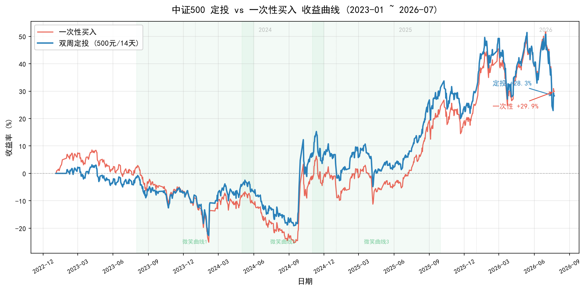

# Day 5 报告 — 用近3年数据验证定投策略

> 实习生：______ | 日期：2026-07-__ | 协作助手：QClaw

---

## 一、数据获取

### 1.1 基本信息

- 标的：中证500指数（代码：____）
- 数据时间范围：____ 至 ____
- 数据行数：____ 行
- 数据来源：akshare 接口名：____

### 1.2 数据验证

- 收盘价最大值：____（日期：____）
- 收盘价最小值：____（日期：____）
- 数据完整性：是否有缺失日期？____

---

## 二、涨跌周期识别

### 2.1 关键节点

| 指标 | 数值 | 日期 |
|------|------|------|
| 近3年最高点 | ______ | ____年__月__日 |
| 近3年最低点 | ______ | ____年__月__日 |
| 最大回撤 | ______% | 最高→最低 |

### 2.2 按年统计

| 年份 | 起点点位 | 最高点 | 最低点 | 年度特征 |
|------|---------|--------|--------|---------|
| 2023 | ______ | ______ | ______ | 单边上涨/单边下跌/震荡 |
| 2024 | ______ | ______ | ______ | 单边上涨/单边下跌/震荡 |
| 2025 | ______ | ______ | ______ | 单边上涨/单边下跌/震荡 |
| 2026 | ______ | ______ | ______ | 单边上涨/单边下跌/震荡 |

### 2.3 微笑曲线识别

- 是否存在"先跌后涨"的微笑曲线时段？____
- 如果有，具体时段：____年__月 至 ____年__月
- 下跌幅度：____%
- 反弹幅度：____%

---

## 三、回测结果

### 3.1 定投策略

- 起始日期：2023-01-03
- 结束日期：____
- 买入次数：____ 次
- 累计投入：¥____
- 累计份额：____ 份
- 平均成本：¥____/份
- 最终市值：¥____
- **收益率：____%**

### 3.2 一次性买入策略

- 起始日期：2023-01-03
- 投入金额：¥10,000
- 买入份额：____ 份
- 最终市值：¥____
- **收益率：____%**

### 3.3 对比结论

| 策略 | 收益率 | 最终市值 |
|------|-------|---------|
| 定投 | ____% | ¥____ |
| 一次性买入 | ____% | ¥____ |
| **差距** | ____个百分点 | ¥____ |

**谁赢了？** ____

---

## 四、结论分析

### 4.1 为什么是这个结果？

（用涨跌周期数据解释：近3年是涨多跌少还是跌多涨少？有没有微笑曲线？）

你的回答：

### 4.2 Day 2 vs Day 5 的对比

| 对比项 | Day 2（最近1年） | Day 5（近3年） |
|-------|----------------|---------------|
| 数据时段 | 2025-07 至 2026-07 | 2023-01 至 2026-07 |
| 市场特征 | 单边上涨 | ____ |
| 定投收益率 | +0.87% | ____% |
| 一次性买入收益率 | +26.24% | ____% |
| 谁赢 | 一次性买入 | ____ |

**为什么不一样？**

你的回答：

### 4.3 定投的边界条件

**定投在什么行情里占优？**

你的回答：

**定投在什么行情里吃亏？**

你的回答：

**所以定投的核心价值是什么？**

你的回答：

---

## 五、思考题

### 5.1 如果从2024年1月开始定投，到2024年12月，收益率会是多少？

（2024年是典型的微笑曲线年份，可以单独回测验证）

你的回答：

### 5.2 如果能准确预测最高点和最低点，择时买入，收益率能达到多少？

（假设买在最低点、卖在最高点）

你的回答：

### 5.3 现实中，你能预测最高点和最低点吗？

你的回答：

---

## 六、学习心得

- 今天最大的收获：

- 今天最大的卡点：

- 对"定投边界"的新理解：

---

## 七、问题与解决（用 QClaw）

> 至少记录 2 个问题。如实记录：你遇到了什么、怎么问 QClaw 的、它怎么帮你的。

### 问题 1

- 问题描述：

- 怎么问 QClaw：

- 怎么解决的：

### 问题 2

- 问题描述：

- 怎么问 QClaw：

- 怎么解决的：

---

## 八、选做任务（加分）

### 收益曲线图

如果用 Qoder CN 画了收益曲线图，粘贴在此：

### 按年份拆分回测

| 年份 | 定投收益率 | 一次性买入收益率 | 谁赢 |
|------|-----------|----------------|------|
| 2023 | ____% | ____% | ____ |
| 2024 | ____% | ____% | ____ |
| 2025 | ____% | ____% | ____ |
| 2026 | ____% | ____% | ____ |

---

## 九、代码与数据

- 数据文件：`data/000905_history.csv`
- 回测脚本：`backtest_3years.py`
- 代码已提交到 `Day5/code/` 目录

---

**提交前检查**：

- [ ] 所有"你的回答"都替换成实际内容
- [ ] 数据来源、时间范围、收益率等数字都已填写
- [ ] 截图已放在 `Day5/report/assets/` 目录
- [ ] 文件名已改为 `你的名字_Day5报告.md`
