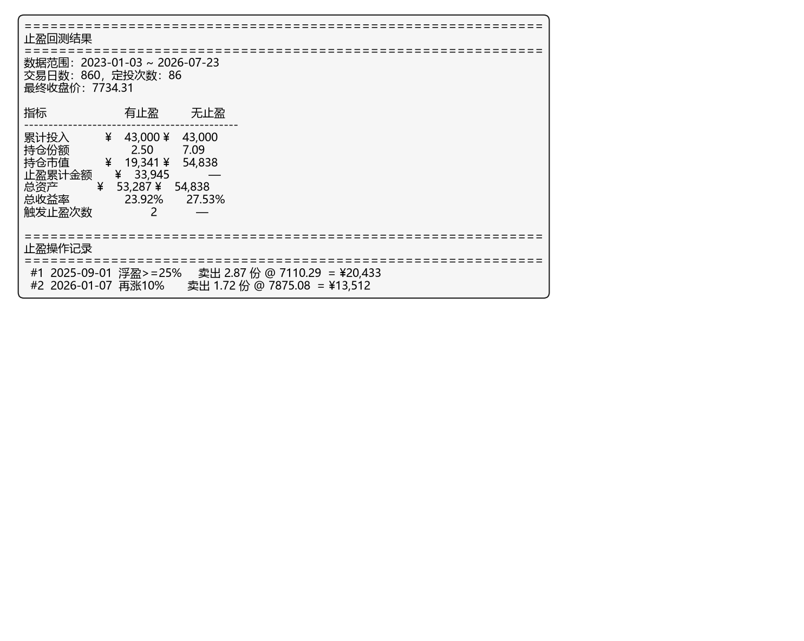
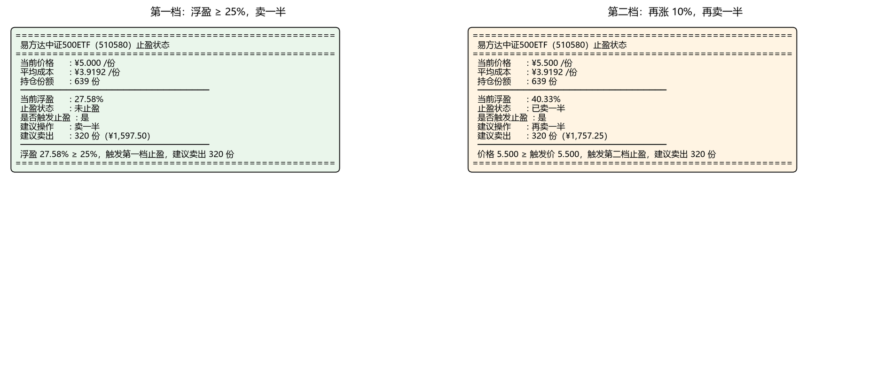

# Day 6 报告 — 理解止盈机制 + 写出止盈工具

> 实习生：Justin | 日期：2026-07-25 | 协作助手：QoderWork

---

## 一、止盈规则理解

### 1.1 用自己的话复述止盈规则

> 止盈是什么？怎么触发？卖多少？

你的回答：止盈是一套提前定好的机械规则，不靠猜顶。当持仓的单轮浮盈达到 +25%（个人设定值，任务书建议 25%~30% 区间）时触发。触发后分两批卖：第一批卖出一半持仓，锁定部分利润；如果价格继续涨 10%，再卖出剩余的一半。但永远不清仓——留底仓，定投也不停。止盈出来的钱先放货币基金，等 PE 分位回落到 30% 以下再重新加回定投。PE 分位超过 70% 只是提醒信号，不直接触发止盈。


### 1.2 止盈的本质

> 止盈是"逃顶"吗？它和择时有什么区别？

你的回答：止盈不是逃顶。逃顶试图预测最高点，本质是择时——赌一个"最佳卖点"。止盈不猜顶，它承认没人知道哪里是最高价，所以提前写好条件（浮盈达标）和执行动作（分批卖出），到了就机械执行。区别在于：择时依赖主观判断，容易犹豫或贪婪；止盈依赖规则，消除情绪干扰。止盈的目标不是卖在最高点，而是"在合理区间锁定一部分利润，同时保留继续上涨的可能性"。


---

## 二、止盈后还继续定投吗？

### 2.1 回答问题

**问题**：止盈卖出的钱怎么处理？还继续定投吗？

你的回答：止盈卖出的钱不拿去消费或追其他品种，而是转入货币基金"暂存"。定投不停——继续按原来的节奏和金额买入。但止盈出来的这笔钱不急着重新投入，而是等 PE 分位回落到 30% 以下（即估值重新变得便宜）时，再把这笔钱加回定投，增加每期的投入金额。简单说就是：止盈的钱先"避风头"，等便宜了再回来。


### 2.2 解释原因

**为什么不止盈后停止定投？**

你的回答：因为定投的核心优势是"在低位持续积累筹码"。如果止盈后就停投，一旦市场回调到便宜区间，你就没有新的买入动作，等于白白浪费了低价捡筹的机会。止盈只是锁定了一部分利润、降低了持仓风险，但行情可能继续涨，也可能跌回来。不停投保证了两种情况都能应对：涨了，手里还有底仓在赚钱；跌了，定投在低位持续摊薄成本，为下一轮止盈做准备。停投等于主动放弃这个机制，把"持续作战"变成了"一次性博弈"。


---

## 三、止盈状态机

### 3.1 画出止盈状态机

用文字描述止盈的几种状态和转换：

```
状态1：未止盈（浮盈 < 25%）
    ↓ 浮盈 ≥ 25%
状态2：已卖一半（卖出持仓的 1/2，记录卖出价 p1）
    ↓ 价格 ≥ p1 × 1.10（再涨 10%）
状态3：已卖四分之三（再卖剩余持仓的 1/2）
    ↓ 浮盈回落至 < 25%
回到状态1（新一轮，定投继续，均价已变）
```

### 3.2 关键规则

1. 每次最多卖一半，始终保留底仓（永不清仓）
2. 不猜顶，规则触发就执行，不凭感觉（不择时）
3. 止盈后定投不停，持续在低位积累筹码继续定投）
4. PE 分位 >70% 仅作提醒，不触发止盈；回落至 <30% 时止盈资金加回定投（估值参考）

---

## 四、历史数据验证

### 4.1 回测参数

- 数据范围：2023-01-03 ~ 2026-07-23
- 定投规则：双周 ¥500，弹性股数法
- 止盈规则：浮盈 ≥ 25% 卖 1/2，继续涨 10% 再卖 1/2

### 4.2 回测结果

| 指标 | 有止盈 | 无止盈 |
|------|-------|--------|
| 总收益率 | 23.92% | 27.53% |
| 触发止盈次数 | 2 | - |
| 累计止盈金额 | ¥33,945 | - |
| 最终持仓 | 2.50 份 | 7.09 份 |



### 4.3 分析

**有止盈 vs 无止盈，为什么结果是这样？**

你的回答：这段时间（2023-01 到 2026-07）中证500经历了一轮明显的上涨行情，最终收盘 7734 点。无止盈策略因为始终满仓持有全部 7.09 份，完整吃到了整段涨幅，总收益 27.53%。有止盈策略在 2025-09 和 2026-01 分两次卖出了大部分持仓（共收回 ¥33,945 现金），虽然锁定了利润，但剩余持仓只剩 2.50 份，后续上涨时仓位不足，总收益略低（23.92%）。

这说明：在单边上涨行情中，止盈会"卖早"，总收益不如死拿。但止盈的价值不在于牛市赚更多，而在于震荡市或先涨后跌的行情中保护利润——它让你在高位至少拿到了一部分现金，而不是全部坐过山车回去。这 23.92% 的收益里包含了 ¥33,945 的"落袋为安"，风险敞口远小于无止盈的满仓。


### 4.4 止盈操作记录

| # | 日期 | 触发条件 | 卖出份额 | 卖出金额 |
|---|------|---------|---------|---------|
| 1 | 2025-09-01 | 浮盈 ≥ 25% | 2.87 份 | ¥20,433 |
| 2 | 2026-01-07 | 再涨 10% | 1.72 份 | ¥13,512 |

---

## 五、止盈工具 profit_taker.py

### 5.1 工具功能

- 输入：当前价格
- 输出：当前浮盈、是否止盈、建议操作、卖多少股

### 5.2 工具测试结果

当前持仓数据（用回测模拟数据演示）：
- 平均成本：¥3.9429/份（回测中 2025-09 止盈触发时的均价）
- 当前价格：¥5.000/份
- 当前浮盈：26.81%

工具输出：
```
☐ 当前浮盈：26.81%
☐ 是否触发止盈：是
☐ 当前止盈状态：未止盈
☐ 建议操作：卖一半
☐ 如果要卖，卖 190 份（¥947.50）
```

记录卖出后，价格涨到 5.5：
```
☐ 当前浮盈：39.49%
☐ 是否触发止盈：是
☐ 当前止盈状态：已卖一半
☐ 建议操作：再卖一半
☐ 如果要卖，卖 190 份（¥1,042.25）
```



### 5.3 工具核心代码逻辑

描述工具是怎么判断的（用文字，不是代码）：

你的回答：工具分三步判断。第一步，从 portfolio.xlsx 读取累计投入和累计份额，算出平均成本（累计投入 ÷ 累计份额）。第二步，用当前价格算浮盈：（当前价 - 均价）÷ 均价。第三步，读取 JSON 状态文件确定当前处于哪个阶段：如果状态是"未止盈"且浮盈 ≥ 25%，建议卖一半，并把第二档触发价设为卖出价 × 1.10；如果状态是"已卖一半"且当前价 ≥ 触发价，建议再卖剩余一半；如果状态是"已卖 3/4"且浮盈回落到 25% 以下，自动重置为"未止盈"开始新一轮。每次卖出操作记录在 JSON 文件里，下次运行时读取，保证状态跨次运行不丢失。


---

## 六、思考题

### 6.1 为什么"永不清仓"？

> 定投的纪律是"机械执行"，为什么止盈规则设计为"永不清仓"而不是"全部卖出"？

你的回答：清仓意味着你彻底离开了这个标的。定投是一个持续积累筹码的过程，清仓等于把之前所有的成本摊薄成果全部归零，下次想重新进场又得从头开始择时。留底仓保证了即使止盈后市场继续涨，你手里还有仓位在赚钱，不会完全踏空。同时底仓也是纪律的锚——你还在车上，就不会因为"卖飞了"而产生追高或放弃的冲动。止盈的目的是降低风险，不是退出战场。


### 6.2 PE 分位在止盈中扮演什么角色？

> 任务书说"PE 分位 > 70% 时提醒关注止盈"，但"触发止盈的是目标收益率，不是分位"。为什么这样设计？

你的回答：PE 分位是"温度计"，不是"发令枪"。分位 >70% 告诉你"市场偏贵了，留意止盈机会"，但真正触发卖出的还是浮盈 ≥25% 这个硬指标。这样设计是因为 PE 分位可以长时间停留在高位（比如牛市里估值可以一直贵下去），如果用它触发止盈，可能过早卖出错过主升浪。而目标收益率是你自己的真金白银的浮盈，它直接反映你的持仓盈亏，比估值更"诚实"。PE 分位的另一个用途是止盈后资金回补：分位回落到 30% 以下才把止盈的钱加回定投，确保在便宜时加仓。


### 6.3 如果没有止盈规则，会怎样？

> 用 Day 5 的数据回答：如果一直不止盈，持有到现在，收益率是多少？止盈带来了什么价值？

你的回答：回测数据直接回答：无止盈总收益率 27.53%，有止盈 23.92%。看起来无止盈反而多赚了 3.6 个百分点，但这是"事后诸葛亮"——因为这段时间中证500整体走牛，一路涨到了 7734 点。

止盈的价值不体现在单边牛市里，而体现在先涨后跌的场景。回测里有止盈在 2025-09 和 2026-01 分别收回了 ¥20,433 和 ¥13,512 现金（共 ¥33,945），这部分钱已经落袋，不怕回调。如果 2026 年初之后市场来一波 20% 的回撤，无止盈的满仓会全部坐过山车，而有止盈的策略手里有大把现金，反而能在低位继续捡筹码。

一句话：止盈不是为了赚最多，而是为了确保赚到的钱不会白白还回去。


---

## 七、学习心得

- 今天最大的收获：理解了止盈和逃顶的本质区别。止盈不是猜最高点，而是用规则消除情绪干扰。回测结果也给了一个反直觉的启发——在牛市里止盈反而少赚，但这恰恰说明止盈的价值在于保护利润而非追求最大收益。

- 今天最大的卡点：止盈状态机的"重置"逻辑。一开始纠结卖完 3/4 之后怎么回到新一轮，后来想通了：只要浮盈回落到 25% 以下就自动重置，均价因为定投一直在变，所以不需要手动调整。

- 对"止盈 + 定投"的新理解：这两者不矛盾，而是互补。定投负责在低位持续积累筹码，止盈负责在高位锁定一部分利润。一个管"买"，一个管"卖"，合在一起才是一个完整的投资纪律。


---

## 八、问题与解决（用 QClaw）

> 至少记录 2 个问题。

### 问题 1

- 问题描述：回测脚本里"继续涨 10%"的基准是什么？是从均价涨 10%，还是从第一次卖出价涨 10%？
- 怎么问 QoderWork：把任务书里的止盈规则和回测脚本伪代码贴给它，问第二档触发价的计算方式。
- 怎么解决的：确认是以第一次卖出价为基准涨 10%（即 trigger2 = sell_price × 1.10），而不是均价。因为任务书说的是"再涨 10%"，指的是从卖出后继续上涨，不是从成本价。

### 问题 2

- 问题描述：portfolio.xlsx 文件损坏导致 profit_taker.py 运行报错 BadZipFile。
- 怎么问 QoderWork：把报错信息贴给它，问怎么处理。
- 怎么解决的：在 `_get_holdings()` 里加了 try-except 容错，读取失败时返回空持仓而不是崩溃。同时把损坏的 xlsx 备份为 .bak，让 recorder.py 下次自动重建。


---

## 九、选做任务（加分）

### 止盈可视化

未做。

### 止盈工具增强

profit_taker.py 已实现以下增强功能：

- **JSON 状态持久化**：卖出记录和止盈状态保存在 `profit_taker_state.json`，跨次运行不丢失
- **CLI 完整交互**：支持 `python profit_taker.py <价格>` 查看状态、`--sell` 记录卖出、`--history` 查看历史、`--reset` 重置状态
- **容错处理**：portfolio.xlsx 损坏时不崩溃，返回空持仓并警告
- **自动重置**：状态 2（已卖 3/4）浮盈回落到 25% 以下时自动重置为状态 0，开始新一轮


---

## 十、代码与工具

- 止盈工具：`tools/profit_taker.py`
- 止盈回测脚本：`Day6/code/profit_taker_backtest.py`
  - 回测数据：`Day5/code/data/000905_history.csv`（不重新拉）
- 代码已提交到 GitHub

---

**提交前检查**：

- [x] 所有"你的回答"都替换成实际内容
- [x] 止盈回测结果已填写
- [x] 止盈工具测试输出已填写
- [x] 截图已放在 `Day6/report/assets/` 目录
- [x] 文件名已改为 `你的名字_Day6报告.md`
- [ ] PR 只有 Day 6 相关文件
