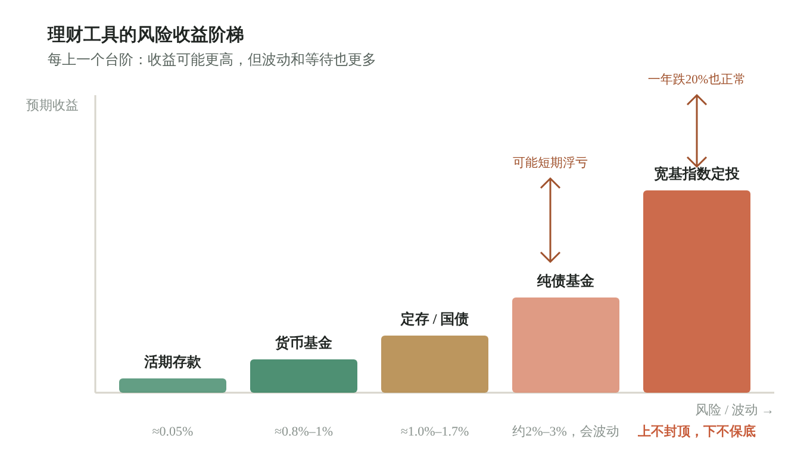
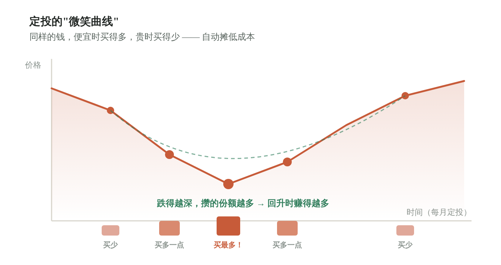
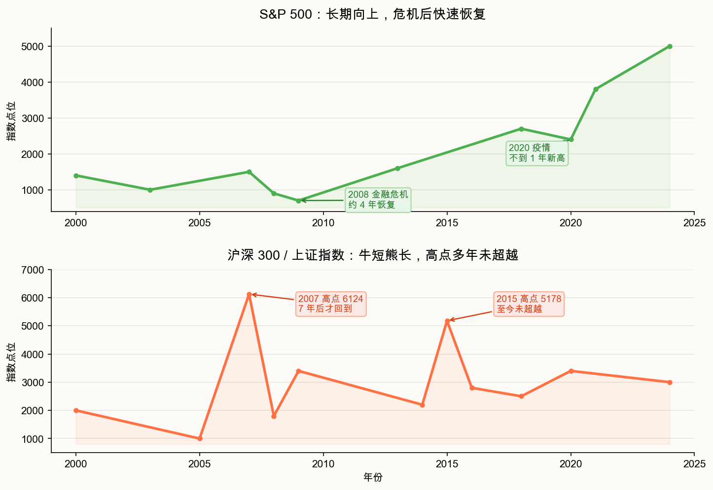

# 如何定投一只宽基指数基金？

前面的四课，我们分别讲了**为什么要理财**（第零课）、**有哪些工具可选**（第 0.5 课）、**为什么宽基指数定投适合普通人**（第一课）、**为什么要用 AI 工具帮自己守纪律**（第二课）。

这一篇，我们把这些原则落成"怎么做"——沿着一轮定投的**完整生命周期**，走完五步：准备、建仓、持有、止盈、纪律。

> 这不是某一只基金的推荐，而是一套你随时可以照着做的**方法论**。换一只宽基指数，流程一样成立。

## 目录

1. [第一步：确认这笔钱配得上定投](#第一步确认这笔钱配得上定投)
2. [第二步：选一只宽基指数基金](#第二步选一只宽基指数基金)
3. [第三步：定投日怎么买](#第三步定投日怎么买)
4. [第四步：持有期看什么不看什么](#第四步持有期看什么不看什么)
5. [第五步：何时卖与纪律止盈](#第五步何时卖与纪律止盈)
6. [跌了怎么办：不止损只看三件事](#跌了怎么办不止损只看三件事)
7. [一轮定投的闭环](#一轮定投的闭环)

---

## 第一步：确认这笔钱配得上定投

定投的第一原则不是"买什么"，而是"**用谁的钱买**"。

第零课讲过"三个口袋"和"不可能三角"：流动性、收益、安全，三者不可兼得。定投牺牲的是流动性——它要求这笔钱**至少三到五年用不到**。拿下个月的生活费、下个学期的学费去定投，等于把"长期复利"押在"短期要用"上，一旦中途要用钱，浮亏就被迫变成实亏。

判断一笔钱是否"配得上"定投，问自己一句：

> **"这笔钱如果明天跌了 30%，会影响我的生活或学业吗？"**
> 会 → 它不是闲钱，请放回活期或货币基金。
> 不会 → 它才进得了"投资口袋"，才有资格被定投。

三条红线（第零课）在这里是底线：不借钱投资、不投救命钱、不投看不懂的东西。定投解决不了"钱不够"的问题，它只解决"有了闲钱怎么不被通胀吃掉"的问题。

---

## 第二步：选一只宽基指数基金

确认了闲钱，下一步是选标的。一句话：**普通人首选宽基指数基金，别碰个股、别碰行业基金、别信"冠军基金"。**

为什么是宽基（第一课）？

- **大多主动基金长期跑不赢指数**，你还得多付一层管理费。
- **指数会自动优胜劣汰**：成分股变差就被踢出，变好就被纳入，你永远持有"当下最好的那批公司"的平均值。
- **宽基 = 分散风险**：中证 500、沪深 300 这类指数覆盖一整篮子股票，单家公司暴雷，对你的影响只是九牛一毛。



选中证 500 或沪深 300 这样的宽基 ETF 就够了。但同一只指数，往往有多家基金公司发行，**重点看费率**：管理费 + 托管费，是每年从你的资产里悄悄扣走的。两只跟踪同一指数的 ETF，长期看，选费率低的那只——复利几十年，费率的差距会被放大成肉眼可见的收益差。

> 低成本不是"省小钱"，是给你的长期复利多留一口氧气。

---

## 第三步：定投日怎么买

选定标的后，进入真正的"执行"。定投的核心纪律就八个字：**固定金额、固定时间**。

不猜高低、不等人"抄底"——这正是定投和普通炒股最大的区别（第一课）。你只需要设好一个扣款日（比如每月 15 号，或每双周一次），到点就买，雷打不动。

**弹性股数法**：A 股 ETF 按"手"交易，1 手 = 100 份。你每月固定投 ¥500，但基金单价不会刚好让 ¥500 买成整数手。做法是：

> 用「金额 ÷ 当前单价 ÷ 100」算出能买几手，向下取整到手，剩下的钱**滚存到下次**。

举例：单价 ¥3.924，投 ¥500 → 500 ÷ 3.924 ÷ 100 ≈ 1.27 手 → 买 **1 手（100 份）**花 ¥392.4，余 **¥107.6 滚存**下次。这样既守住了"固定金额"的纪律，又适应了 A 股"按手交易"的现实。



**记账是纪律的痕迹**。每一笔买入都记下来：日期、价格、买了几手、花了多少、滚存多少。不需要多复杂，一个表格就行。它的价值不在"记"，在于未来你想偷懒跳过时，台账会冷冷地提醒你："你已经坚持了 X 次，现在停，前面的便宜份额就白捡了。"

---

## 第四步：持有期看什么不看什么

买入之后，最难的不是操作，是**忍住不动**。

**不看**：不用天天盯盘。定投不择时，盯盘只会制造焦虑——涨了怕踏空、跌了想割肉，两种情绪都会诱使你打破纪律。第一课的"微笑曲线"告诉我们：定投的利润，恰恰来自下跌时你还在买、把成本摊低的那段"左侧"。

**可以看（但只是事后，不改纪律）**：

> **PE（市盈率）一句话**：你为“每赚 1 块钱”愿意付多少钱。
> 公式 PE = 价格 ÷ 盈利。PE = 15，约等于“按现在盈利，15 年回本”。
> **PE 分位**：把过去约 10 年的 PE 排成一条线，看今天处在历史第几档。分位 80% = 比过去 80% 的时间都贵。
> 定投怎么用：分位 > 70% 只是提醒“偏贵”，**不触发卖出**——宽基含周期股，盈利波动会让 PE 失真，分位会骗人。到了定投日，照样买。

- **PE 估值分位**：了解当前市场贵不贵。但记住——PE 分位 > 70% 只是"提醒你贵了"，**不触发任何卖出动作**（宽基指数在极端行情下 PE 分位都容易失真，尤其含周期股权重的中证 500、沪深 300，盈利波动会让分位失准）。
- **成本曲线**：看自己的平均成本 vs 当前价，确认自己正处在微笑曲线的哪个位置。

**回测是后视镜（第二课）**：用历史数据验证"坚持定投到底有没有用"，能让你在低迷时更有底气。但它**不是挡风玻璃**——过去 10 年这样投赚了，不代表未来 10 年也赚。回测的意义是"坚定你第一天做的决定"，不是"替你预测明天"。



> 持有期的心态，看图就懂：美股长期向上，拿住不动往往是优解；A 股牛短熊长、波动剧烈，所以除了"拿住"，还得在涨到位时"落袋"。这就引出了下一步。

---

## 第五步：何时卖与纪律止盈

定投不是"只买不卖"。尤其在 A 股，第一课讲清了理由：牛短熊长、无分红兜底、散户主导高波动、底部漫长。所以我们的卖出不是"逃顶"，而是**纪律止盈**——给下一轮低位留好子弹。

止盈规则（记住"分批、不清仓、不停扣"）：

| 触发条件 | 动作 |
|----------|------|
| 单轮浮盈 ≥ 25% | 卖出**当前持仓的一半**（第一档），约占总仓位的 50% |
| 第一档卖出后，价格**再涨 10%**（相对第一档卖出时的价格） | 卖出**剩余持仓的一半**（第二档），累计约占总仓位的 75%，仍保留约 25% |
| 移动止盈：浮盈达 +30% 后，从最高点**回撤 10%** | 卖出**剩余全部持仓**，本轮定投结束（辅助，防过山车） |
| PE 分位 > 70% | **仅提醒，不触发**卖出 |

> 说明：上面三档是**分批、递减**地退出（50% → 25% → 25%），任何单档都不一次性清仓。所谓“不清仓”，是指不因恐慌把仓位一把卖光、也不停止定投计划；移动止盈的“离场”是计划内、分阶段的最后一步，离场后定投计划照常继续（进入下一轮）。

几个关键原则：

- **不清仓、不停扣款**：止盈只是把"涨太多的部分"落袋，定投计划继续。
- **止盈资金别闲着**：转出到货币基金 / 纯债基金，等 PE 分位回落到 30% 以下，再分批加回下一轮。
- **卖的是"涨出来的利润"，不是"信心"**：止盈之后市场可能继续涨，接受这点——你赚的是"确定性高的那段"，不是试图吃到每一个顶点。

> 止盈不是逃顶，是给"微笑曲线的左侧"留足弹药，让你在下一轮低位能继续买。

---

## 跌了怎么办：不止损只看三件事

讲到卖，一定会有人问：那跌了、亏了，要不要止损？

答案很反直觉：**对宽基指数定投，没有"价格止损"这回事。**

为什么（第一课「为什么不止损」）？因为定投买的是长期向上的宽基指数——

- **不卖就不亏**：浮亏只是账面数字，不卖出就既不是亏损也不是盈利。
- **下跌让你买更便宜**：同样金额买到更多份额，天然摊薄成本。
- **宽基长期向上**：下跌是暂时的，在低位卖出才是永久的亏损。
- **价格止损 = 择时**："跌到某点就卖"基于价格判断，和"定投不择时"直接冲突。

所以定投里**没有价格止损，只有资金管理止损**：要不要停，看的不是账户跌了多少，而是这三件事——

1. **这笔钱还是闲钱吗？** 性质变了（要急用）→ 可以停，这是资金管理，不是止损。
2. **后续现金还在吗？** 现金流断了 → 自然无法继续。
3. **纪律还在吗？** 连续想着"这次先不投了"，本身就是事实上的停止，最该警惕的不是市场跌，而是你不再扣款。

> **浮亏 20% 是一个预警哨点，不是卖出信号**：它提醒你"低位别因恐惧做傻事（跳过定投）"，并重新逐项核对上面三件事是否还成立。但账户跌多少，不构成停止定投的理由。

---

## 一轮定投的闭环

把五步串起来，一轮定投就是这样一个循环：

```
准备（闲钱确认 → 选宽基 → 看费率）
  ↓
建仓（定投日 → 弹性股数法买入 → 记账）
  ↓
持有（不盯盘 → 看 PE / 成本曲线 → 回测坚定信心）
  ↓
止盈（浮盈25%卖一半 → 再涨10%卖余 → 转货基等低估加回）
  ↓
纪律（不止损 → 只看三件事 → 预警哨点不卖出）
  ↓
（回到建仓，下一轮）
```

你会发现，这套流程里**真正需要你动脑子的决定，第一天就做完了**：投多少、投什么、投多久。之后靠的是"让正确的事变得容易，让错误的事变得麻烦"——这正是 AI 工具的位置（第二课）：

- 它帮你**算**份额（弹性股数法）
- 它帮你**记**台账（每笔买入）
- 它帮你**查** PE、判止盈、定时提醒

但它**不替你判断"投多少"**、**不替你下单**、**不替你预测市场**。工具是纪律的助手，不是思考的替代品。

> 定投不是一场比谁聪明的游戏，是一场比谁有纪律的陪伴。你只要在第一天做对决定，然后让系统和时间，替你走到终点。

---

**← 上一课 · 第二课：[为什么要用 AI 工具做定投？](第二课-为什么要用AI工具做定投.md)  返回系列起点 · 第零课：[为什么大学生就要开始理财实践？](第零课-为什么大学生就要开始理财实践.md) →**

---

> **温馨提示**：本文是面向大学生的财商科普，不构成具体投资建议。文中提及的定投方法、止盈与止损规则为通识性框架，实际操作请结合自身风险承受能力，并通过正规渠道学习。任何声称能"稳赚""保本高收益"的，均为骗局。投资有风险，过往业绩不代表未来表现，永远不要投入你无法承受损失的资金。
