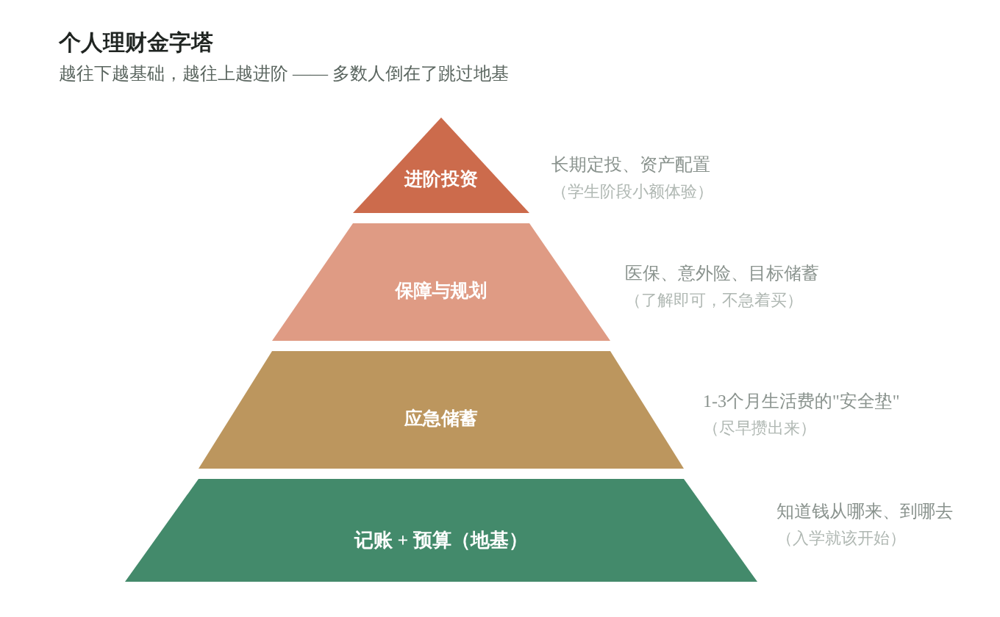

# 为什么大学生就要开始理财实践？

**极简财商 · 第零课**

*不是因为你有钱要理，而是因为"和钱打交道"这件事，越早练，学费越便宜。*

写给大学生的你 · 读完约 6 分钟

---

## 本文目录

1. [理财的意义：它到底在解决什么问题？](#理财的意义它到底在解决什么问题)
2. [为什么大学生现在就该开始？](#为什么大学生现在就该开始)
3. [正确的顺序：一座金字塔](#正确的顺序一座金字塔)
4. [具体怎么做：大学四年练习清单](#具体怎么做大学四年练习清单)
5. [三条红线，任何时候都别碰](#三条红线任何时候都别碰)

## 理财的意义：它到底在解决什么问题？

先说清楚一件事：理财 ≠ 投资，更 ≠ 炒股发财。

理财解决的核心问题只有一个——**让你对自己的钱有掌控感**。知道钱从哪来、花到哪去、留多少应急、什么时候该停手。这是一种和金额无关的基本能力，月生活费 800 块的人同样需要。

为了把这件事想清楚，只需要区分三个概念：

**理财（Money Management）**——管好已有的钱。记账、预算、储蓄、不借不该借的钱。这是地基。

**投资（Investing）**——用闲钱换长期回报，接受波动，用时间换空间。它是理财的进阶动作，地基没打好，楼越高越危险。

**投机（Speculation）**——赌短期涨跌。炒币、跟单、"内幕消息"，包装成投资的样子，本质是赌博。

理财的意义，就是让你**按正确的顺序**和钱打交道：先学会管钱，再小额体验投资，终身远离投机。顺序反了，每一步都是坑。

除了“管住钱”，理财还解决一个更现实的问题：**你的钱在悄悄变少。** 通胀每年大约吃掉 2%-3% 的购买力——今天的一百块，十年后只值七八十块的东西。钱如果只是躺在活期账户里，表面上没少，实际上每天都在缩水。理财的第一步（把钱放到对的位置）就能减缓这种侵蚀，这是**保值**；而在此基础上，通过合理配置让钱的增长跑赢通胀，这是**增值**。保值是底线，增值是目标，两者都不需要“发财”，但都需要你主动去做——不管，就等于默认接受贬值。

> 换个说法：理财不是一门"赚钱技术"，而是一套**成年人的生存技能**。它保护你不被消费主义裹挟、不被骗局收割、不在恐慌中做出不可逆的决定。这种保护，和账户里有多少钱没有关系。

## 为什么大学生现在就该开始？

道理人人懂，但"什么时候开始"才是关键。对大学生来说，有四个理由让"现在"成为最好的起点：

**一、这是消费观的定型期。** 大学是你第一次完全自主支配金钱的阶段。这四年养成的花钱习惯——月光还是结余、冲动还是规划——大概率会跟你十年以上。习惯一旦固化，改起来的代价远高于一开始就建对。

**二、试错成本处于人生最低点。** 现在踩一个坑，损失几百块，心疼三天，记住一辈子。十年后踩同一个坑，损失可能是几万、几十万，可能影响买房首付。**用小钱买教训，是年轻人独有的特权。**

**三、时间是你唯一的大额资产。** 复利公式里，时间的权重远大于本金。18 岁开始的每月 300 块，和 28 岁开始的每月 1000 块，终点可能差不多。早出发几年，比多攒几千块本金有用得多。

**四、骗局专门盯着你。** 校园贷、刷单返利、"稳赚"跟单群……骗子看中的正是新生"有钱、好奇、没经验"这三个特征。财商是最便宜的防骗疫苗——见过套路的人，免疫力完全不同。

> 一句话：**大学开始的不是"投资"，是"练习"。** 就像学车要在空旷场地练，而不是直接上高速。

## 正确的顺序：一座金字塔

很多人失败，是因为顺序反了——还没存钱就想投资，还没预算就想赚钱。正确的顺序从下往上，一层都不能跳：

*塔尖最诱人，但地基才决定你能站多稳。直接跳到塔尖的人，不是投资者，是赌徒。*

学生时代可以做小额投资体验（比如每月 100-300 块的宽基指数定投），目的是**经历涨跌、练习心态**，不是赚钱。这个阶段的"收益"应该用学到的东西来衡量，而不是账户里的数字。

## 具体怎么做：大学四年练习清单

### 第一年：把地基打牢

- **记账三个月。** 不用复杂 APP，备忘录都行。目的不是省钱，是看见——大多数人记完账的第一个反应是"我居然花了这么多？"
- **给生活费做预算。** 吃饭、社交、学习、机动，四个信封。花超了从下月补，不借钱补。
- **分清"想要"和"需要"。** 下单前等 48 小时，还想要再买。这一个动作能砍掉大半冲动消费。

### 接下来：攒出安全垫

- **攒出 1-3 个月生活费的应急金**，放在随取随用的地方（如货币基金）。它的使命不是增值，是让你遇到急事不求人、不借贷。
- **体验"先储蓄后消费"。** 生活费到账当天，先转出 10% 存起来，剩下的再花。顺序反过来，大概率存不下。

### 基础打牢后：小额体验投资

- **只用"丢了不心疼"的钱。** 每月 100-300 块，宽基指数定投，设自动扣款，然后忘掉它。
- **目标设定为"经历一轮涨跌"**，而不是"赚多少"。账户绿过又红过的人，和只看过理论的人，是两种投资者。
- **想继续深入？** 第 0.5 课[《大学生可以用哪些理财工具？》](第0.5课-大学生可以用哪些理财工具.md)先认识工具箱，再到第一课[《为什么大学生就该懂"宽基指数定投"？》](第一课-为什么大学生就该懂宽基指数定投.md)。

## 三条红线，任何时候都别碰

- **不碰任何形式的贷款消费和"校园贷"。** 包括分期买手机、白条套现、"低息"借款。年化利率算下来往往高得吓人，逾期记录会跟你很多年。
- **不借钱投资，不用生活费投资。** 投资的第一原则是"输得起"。借来的钱和吃饭的钱，都输不起。
- **不信任何"稳赚""保本高收益""学长带你做单"。** 收益和风险永远对等，承诺"没有风险的高收益"的人，赚的就是你的本金。

---

> **理财不是一门选修课，是成年人的必修生存技能。**
>
> 大学四年，有人会教你专业知识，但大概率没人系统教你怎么和钱相处。这门课只能自己补——而最好的开学时间，就是现在。从记第一笔账开始，毕业那天你会发现：你攒下的不只是几千块钱，而是一套能保护你一辈子的金钱观。

**下一课 · 第 0.5 课 → [大学生可以用哪些理财工具？](第0.5课-大学生可以用哪些理财工具.md)**

---

> **温馨提示**：本文是面向大学生的财商科普，不构成具体投资建议。文中涉及的记账、储蓄、保险、投资等概念仅作通识介绍，具体操作请通过正规渠道学习，并根据自身情况决定。投资有风险，永远不要投入你无法承受损失的资金。
